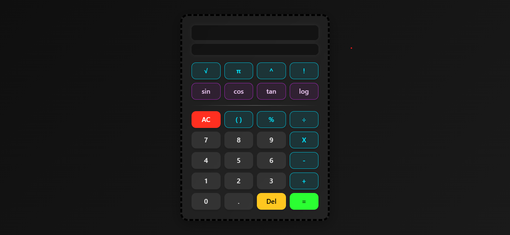

# Scientific Calculator
A fully functional scientific calculator built using HTML, CSS, and Vanilla JavaScript, no external libraries or frameworks.

##  Screenshot

# Features
Basic operations: `+`, `-`, `×`, `÷`
Scientific functions:
Trigonometric: `sin`, `cos`, `tan`
Logarithmic: `log`
Square root: `√`
Power: `^`
Constant: `π`
Factorial: `n!`
Automatic bracket pairing and closing
Full keyboard support (e.g., `Enter`, `Backspace`, `Delete`)
Clean UI with separate input and output display
Error handling for invalid expressions
Mobile-ready structure (can be enhanced further with responsive CSS)

# About the Project
This project focuses on core JavaScript logic and DOM manipulation. The calculator interface consists of dynamic buttons and input fields that update in real time as users interact with the calculator either via mouse or keyboard.
Internally, all button values are checked and converted into valid JavaScript expressions compatible with the `eval()` function. For example:

`X` → `*`
`÷` → `/`
`^` → `**`
`π` → `Math.PI`
`√(` → `Math.sqrt(`
`sin(` → `Math.sin(Math.PI / 180 * ...` (degree-to-radian conversion)

Before evaluating the final expression, the calculator ensures all open brackets are properly closed, preventing syntax errors during calculation.

# Developer Journey
While building this project, I faced a key challenge with scientific functions like `sin`, `cos`, `log`, etc., which require parentheses (for example, `sin(30)`). I initially added the opening bracket automatically when the user clicked on a function. However, I struggled with how to close those brackets, this led to `eval()` errors and broken calculations.

After long time & struggle, I fixed it:
Before evaluating the expression when `=` is pressed, I check for unmatched opening brackets.
If any are found, I automatically append the required closing brackets to balance the expression.
Only then do I pass the sanitized string to `eval()`.

I also learned how important it is to convert all custom UI button values into valid JavaScript expressions before evaluation, otherwise the calculator logic would break.

# How to Use
1. Clone or download the project.
2. Open `index.html` in any modern browser.
3. Click buttons or use keyboard to input expressions.
4. Press `=` or `Enter` to calculate.

# Bug or Future Improvements (To-Do)
Backspace only deletes from the end — needs update to allow deleting at cursor position (like normal text editing).